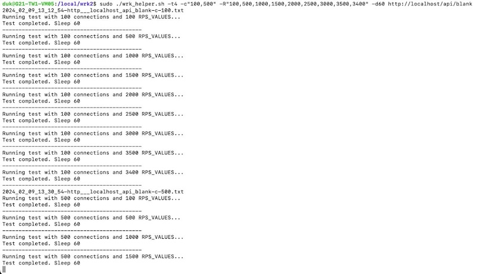

# WRK helper
A script for automating web application performance testing using [wrk](https://github.com/wg/wrk) or [wrk2](https://github.com/giltene/wrk2), running a series of tests with different parameters.

## Basic Usage

`./wrk_helper.sh -t4 -c"100,500" -R"100,500,1000,3000" -d60 http://localhost`

## Command Line Options
```
Usage: ./wrk_helper.sh [OPTIONS] <url>

Options:
  -h                Display this help message
  -t <threads>      Number of threads (default: 1)
  -c <connections>  Array of numbers of connections (eg: "50,100,1000") (default: 1)
  -R <RPS>          Array of requests per second (eg: "50,100,1000") (default: 100)
  -d <duration>     Test duration (default: 30)
  -s <sleep>        Sleep between iterations (default: 30)
  -p <exec path>    Path to wrk executable (default: wrk)
  -v <verbose>      Duplicate wrk output to console
```

## Previews


